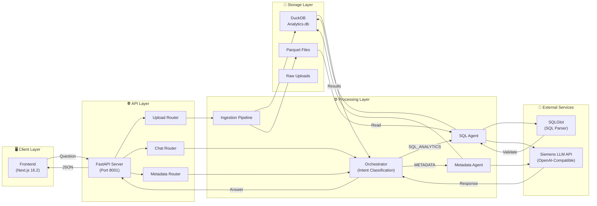
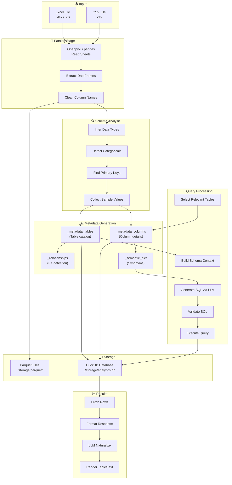
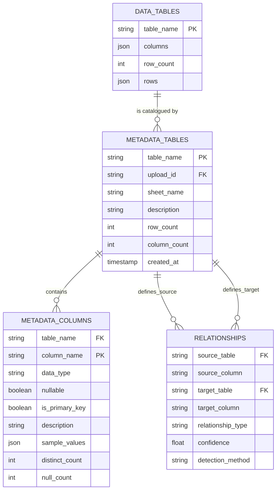
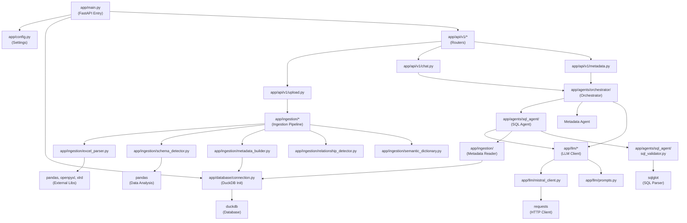
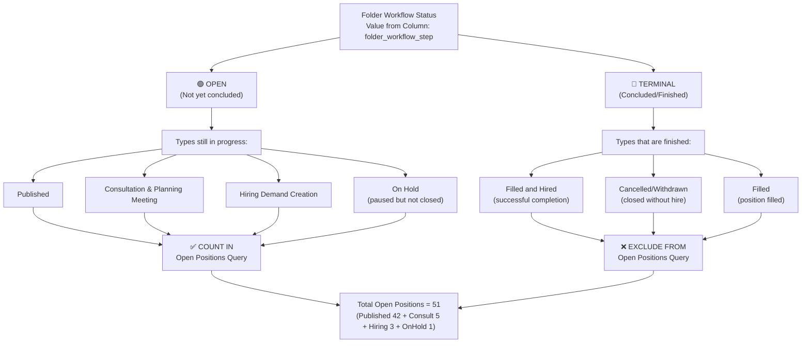
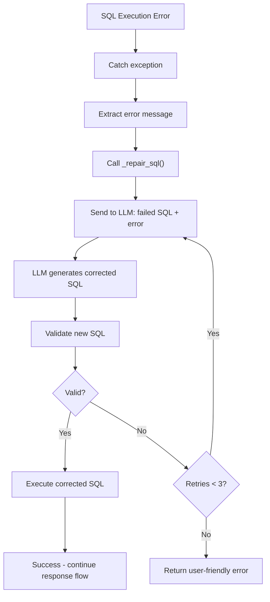

# Excel Intelligence — Backend Architecture & Workings

## Overview

**Excel Intelligence** is a conversational analytics platform that allows users to upload Excel/CSV files and ask natural language questions about their data. The backend converts these questions into SQL queries, executes them, and returns AI-generated natural language responses with optional markdown tables.

**Tech Stack:**
- **Framework:** FastAPI (async Python)
- **Database:** DuckDB (in-process, columnar, analytical)
- **LLM:** Siemens OpenAI-compatible API (`gpt-oss-120b` model)
- **Data Processing:** Pandas, PyArrow, Parquet
- **Validation:** Pydantic v2 + pydantic-settings

**Port:** 8001 (configured in `.env` via uvicorn)

---

## Architecture Diagram

```
┌─────────────────────────────────────────────────────────────────┐
│                         FastAPI Server                          │
│                       (Port 8001, CORS enabled)                 │
└─────────────────────────────────────────────────────────────────┘
                              │
                ┌─────────────┼─────────────┐
                │             │             │
         ┌──────▼──────┐ ┌───▼────┐ ┌──────▼────────┐
         │   UPLOAD    │ │  CHAT  │ │   METADATA   │
         │   ROUTER    │ │ROUTER  │ │    ROUTER    │
         └──────┬──────┘ └───┬────┘ └──────┬───────┘
                │             │             │
                │             ▼             │
                │      ┌──────────────┐    │
                │      │  ORCHESTRATOR│    │
                │      │  (Intent     │    │
                │      │   Classification) │
                │      └──┬───┬──────┘    │
                │         │   │           │
         ┌──────▼──┐ ┌────▼┐ ┌▼──────┐  │
         │INGESTION│ │SQL  │ │METADATA│ │
         │PIPELINE │ │AGENT│ │AGENT  │  │
         └─────┬───┘ └────┬┘ └┬──────┘  │
               │          │   │         │
               │          ▼   │         │
         ┌─────▼───────────────┴─────────┤
         │       DuckDB DATABASE         │
         │  (analytics.duckdb)           │
         │                               │
         │  Data Tables                  │
         │  Metadata Catalog             │
         │  Relationships                │
         └───────────────────────────────┘
                      │
         ┌────────────┴────────────┐
         │                         │
    ┌────▼────────┐        ┌───────▼──────┐
    │  Parquet    │        │  LLM Service │
    │  Storage    │        │ (Siemens API)│
    │             │        │              │
    │ *.parquet   │        │ OpenAI-compat│
    └─────────────┘        └──────────────┘
```

---

## Visual Diagrams & Graphs

### 1. System Architecture Graph



---

### 2. Data Flow Graph



---

### 3. Database Entity-Relationship Diagram



---

### 4. SQL Query Execution Flow (Detailed)

```mermaid
graph TD
    Start["🔴 START: User Question"] --> Q["Question: 'how many open positions in DTS?'"]
    Q --> Retrieve["1️⃣ RETRIEVE METADATA"]
    
    Retrieve --> GetTables["Query _metadata_tables"]
    GetTables --> GetCols["Query _metadata_columns"]
    GetCols --> GetRels["Query _relationships"]
    GetRels --> MetaReady["✅ Metadata loaded"]
    
    MetaReady --> TableSelect["2️⃣ SELECT TABLES"]
    TableSelect --> BuildSummary["Embed: question + schema summary"]
    BuildSummary --> Similarity["Cosine similarity ranking"]
    Similarity --> RankTables["Pick top 3-5 tables"]
    RankTables --> TablesSelected["✅ Tables selected"]
    
    TablesSelected --> BuildSchema["3️⃣ BUILD SCHEMA CONTEXT"]
    BuildSchema --> IterTables["For each selected table:"]
    IterTables --> ListCols["- List columns + types"]
    ListCols --> DistinctVals["- Fetch distinct values for categoricals"]
    DistinctVals --> SchemaBuilt["✅ Schema context ready\n<br/>Example: folder_workflow_step: Published, Cancelled/Withdrawn, Filled, ..."]
    
    SchemaBuilt --> GenSQL["4️⃣ GENERATE SQL"]
    GenSQL --> LLMPrompt["Send SQL_GENERATION prompt to LLM"]
    LLMPrompt --> SQLResponse["LLM response: JSON with sql key"]
    SQLResponse --> ParseJSON["5️⃣ PARSE JSON"]
    
    ParseJSON --> Direct["Try direct JSON.parse()"]
    Direct --> TryDirect{Valid?}
    TryDirect -->|Yes| Extracted["✅ SQL extracted"]
    TryDirect -->|No| FenceBlock["Try fenced ```json block"]
    FenceBlock --> TryFence{Valid?}
    TryFence -->|Yes| Extracted
    TryFence -->|No| Substring["Try first {…} substring"]
    Substring --> TrySubstring{Valid?}
    TrySubstring -->|Yes| Extracted
    TrySubstring -->|No| RegexScan["Try regex scan all blocks"]
    RegexScan --> TryRegex{Valid?}
    TryRegex -->|Yes| Extracted
    TryRegex -->|No| Empty["Return {} (logged error)"]
    Empty --> Validate
    
    Extracted --> Validate["6️⃣ VALIDATE SQL"]
    Validate --> Sqlglot["Parse via sqlglot"]
    Sqlglot --> CheckSyntax{Syntax OK?}
    
    CheckSyntax -->|No| Repair["❌ REPAIR ATTEMPT"]
    Repair --> RepairPrompt["Send SQL_REPAIR prompt"]
    RepairPrompt --> RepairResponse["LLM fixes SQL"]
    RepairResponse --> ParseJSON
    
    CheckSyntax -->|Yes| Execute["7️⃣ EXECUTE SQL"]
    Execute --> DuckDB["Run on DuckDB read connection"]
    DuckDB --> FetchResults["Fetch rows (max 200)"]
    FetchResults --> CheckSuccess{Execution OK?}
    
    CheckSuccess -->|Error| Repair
    CheckSuccess -->|Yes| Format["8️⃣ FORMAT RESPONSE"]
    
    Format --> ResponsePrompt["Send RESPONSE_FORMAT prompt"]
    ResponsePrompt --> ResultsCtx["Provide: question, SQL, results table"]
    ResultsCtx --> LLMFormat["LLM generates natural language answer"]
    LLMFormat --> CheckRows{Multi-row?}
    
    CheckRows -->|Yes| MarkdownTable["📊 Render as markdown table"]
    CheckRows -->|No| TextAnswer["📝 Render as text summary"]
    
    MarkdownTable --> AddSummary["Add summary/total row"]
    AddSummary --> Response["✅ Answer ready"]
    TextAnswer --> Response
    
    Response --> Compose["Return ChatResponse JSON:"]
    Compose --> JSON["{ intent, answer, sql_result, processing_time_ms }"]
    JSON --> End["🟢 END: Return to User"]
```



---

### 5. Component Dependency Graph



---

### 6. Status Semantics Graph (Open vs Terminal)



---

## Complete Chat Flow Diagram

```mermaid
graph TD
    A["👤 User Sends Question"] --> B["📩 POST /api/v1/chat"]
    B --> C["Orchestrator: handle_question()"]
    
    C --> D["🎯 Step 1: Classify Intent"]
    D --> E["Build brief schema summary"]
    E --> F["Send to LLM with INTENT_CLASSIFICATION prompt"]
    F --> G["LLM Response: intent classification"]
    
    G --> H{Intent?}
    
    H -->|SQL_ANALYTICS| I["🔧 SQL Agent Route"]
    H -->|METADATA| J["📚 Metadata Agent Route"]
    H -->|GREETING| K["👋 Greeting Route"]
    
    %% SQL_ANALYTICS Path
    I --> I1["1️⃣ Retrieve Metadata"]
    I1 --> I2["Query _metadata_tables & _metadata_columns"]
    I2 --> I3["2️⃣ Select Relevant Tables"]
    I3 --> I4["Embed question + metadata summaries"]
    I4 --> I5["Cosine similarity ranking"]
    I5 --> I6["Keep top 3-5 tables"]
    I6 --> I7["3️⃣ Build Schema Context"]
    I7 --> I8["For each selected table:"]
    I8 --> I9["- List columns with types"]
    I9 --> I10["- Fetch distinct values for categorical cols"]
    I10 --> I11["- Include semantic hints & relationships"]
    I11 --> I12["4️⃣ Generate SQL"]
    I12 --> I13["Send to LLM with SQL_GENERATION prompt"]
    I13 --> I14["Prompt includes:"]
    I14 --> I14A["  • Schema context with distinct values"]
    I14A --> I14B["  • Status semantics (open vs terminal)"]
    I14B --> I14C["  • Prefer GROUP-BY for breakdowns"]
    I14C --> I14D["  • Count rows, not headcounts"]
    I14D --> I15["LLM returns JSON: sql + explanation"]
    I15 --> I16["5️⃣ Parse & Validate SQL"]
    I16 --> I17["Multi-strategy JSON parser"]
    I17 --> I18["Validate syntax via sqlglot"]
    I18 --> I19{SQL Valid?}
    
    I19 -->|No| I20["⚠️ Call _repair_sql()"]
    I20 --> I21["Send error + context to LLM"]
    I21 --> I22["LLM fixes and returns new SQL"]
    I22 --> I23{Retry Count < 3?}
    I23 -->|Yes| I16
    I23 -->|No| I24["❌ Return error to user"]
    
    I19 -->|Yes| I25["6️⃣ Execute SQL"]
    I25 --> I26["Run on DuckDB read connection"]
    I26 --> I27["Fetch results (max 200 rows)"]
    I27 --> I28["7️⃣ Format Response"]
    I28 --> I29["Send SQL results to LLM with RESPONSE_FORMAT"]
    I29 --> I30["LLM converts to natural language"]
    I30 --> I31{Multi-row results?}
    I31 -->|Yes| I32["📊 Render as markdown table"]
    I32 --> I33["Add summary/total row"]
    I31 -->|No| I34["🔢 Single value or brief text"]
    I33 --> I35["Return answer + sql_result + metadata"]
    I34 --> I35
    
    %% Metadata Path
    J --> J1["Fetch all table metadata"]
    J1 --> J2["Send to LLM with METADATA_RESPONSE prompt"]
    J2 --> J3["LLM describes tables, columns, relationships"]
    J3 --> J4["Return answer with no SQL results"]
    
    %% Greeting Path
    K --> K1["Return canned friendly response"]
    K1 --> K2["No SQL execution needed"]
    
    %% Final Response
    I24 --> L["📤 Compose ChatResponse"]
    I35 --> L
    J4 --> L
    K2 --> L
    
    L --> M["Return JSON to Frontend"]
    M --> N["✅ Frontend renders answer + optional table"]
```



### Flow States & Data Structures

**1. Intent Classification Output:**
```json
{
  "intent": "SQL_ANALYTICS",      // or METADATA, GREETING
  "confidence": 0.95,
  "reason": "User is asking about data counts"
}
```

**2. SQL Agent SQLResult Output:**
```json
{
  "success": true,
  "sql": "SELECT folder_workflow_step, COUNT(*) FROM ... GROUP BY 1",
  "columns": ["folder_workflow_step", "COUNT(*)"],
  "rows": [
    ["Published", 42],
    ["Consultation & Planning Meeting", 5],
    ["Hiring Demand Creation", 3],
    ["On Hold", 1]
  ],
  "row_count": 4,
  "error": null
}
```

**3. Final ChatResponse:**
```json
{
  "intent": "SQL_ANALYTICS",
  "answer": "Here's the current count of open positions for the **DTS**...\n\n| folder_workflow_step | Count |\n|---|---:|\n| Published | 42 |...",
  "sql_result": { /* SQLResult above */ },
  "processing_time_ms": 4230
}
```

---

## Key Decision Points in Flow

| Decision | Options | Logic |
|----------|---------|-------|
| **Intent Classification** | SQL_ANALYTICS / METADATA / GREETING | LLM analyzes question against schema |
| **Table Selection** | Use all / Use top N | Similarity rank to reduce context |
| **SQL Generation** | Direct / With repair retries | Validate syntax, retry up to 3x on error |
| **Result Formatting** | Table / Text / Single value | Multi-row → markdown table; single row → text |
| **Rendering in UI** | Show ResultTable / Skip | Skip if answer already contains markdown table |

---

## Error Handling Flow



---

## Core Components

### 1. **Configuration** (`app/config.py`)

Loads environment variables via pydantic-settings from `.env`:

```python
Settings:
  - llm_api_url         # Siemens API endpoint
  - llm_api_key         # Bearer token
  - llm_model_name      # Currently "gpt-oss-120b"
  - llm_timeout_sec     # 60 seconds default
  - duckdb_path         # ./storage/analytics.duckdb
  - upload_dir          # ./storage/raw_files
  - parquet_dir         # ./storage/parquet
  - backend_host, backend_port
```

### 2. **FastAPI App** (`app/main.py`)

- Initializes DuckDB on startup via `get_write_connection()`
- Creates metadata tables if they don't exist
- Mounts three API routers (upload, chat, metadata)
- Configures CORS to allow frontend at any origin
- Includes health check endpoint

### 3. **API Routers**

#### **Upload Router** (`app/api/v1/upload.py`)
- `POST /api/v1/upload` — Accept file(s) (Excel, CSV)
  - Calls ingestion pipeline
  - Returns table names and row counts

#### **Chat Router** (`app/api/v1/chat.py`)
- `POST /api/v1/chat` — Synchronous Q&A endpoint
  - Input: `{"question": "how many open positions in DTS?"}`
  - Output: `ChatResponse` with intent, answer, and optional SQL results
- `POST /api/v1/chat/stream` — Streaming SSE response (token-by-token)

#### **Metadata Router** (`app/api/v1/metadata.py`)
- `GET /api/v1/metadata` — Retrieve schema and column info for all tables
- `GET /api/v1/metadata/{table}` — Details for a specific table

---

## Question Handling Pipeline

### Step 1: Intent Classification (`orchestrator.py`)

The orchestrator receives a question and classifies it into one of three intents:

| Intent | Description | Handler |
|--------|-------------|---------|
| `SQL_ANALYTICS` | Data query (e.g., "count open positions") | SQL Agent |
| `METADATA` | Schema/structure question (e.g., "what tables are there?") | Metadata Agent |
| `GREETING` | Casual (e.g., "hello", "thanks") | Simple response |

**Process:**
1. Build a brief schema summary (table names, row counts, column names)
2. Send to LLM with `INTENT_CLASSIFICATION` prompt
3. LLM returns JSON: `{"intent": "...", "confidence": float, "reason": "..."}`

### Step 2: Route by Intent

#### **SQL_ANALYTICS Route → SQL Agent** (`app/agents/sql_agent/agent.py`)

**Sub-pipeline (5 steps):**

1. **Retrieve Metadata**
   - Query `_metadata_tables` and `_metadata_columns` catalog
   - Get table names, column types, distinct values

2. **Select Relevant Tables** (`_select_tables`)
   - Embed user question + metadata summaries
   - Use Cosine similarity to rank tables
   - Keep top 3–5 tables to reduce context size

3. **Build Schema Context** (`_build_schema_context`)
   - For each selected table, list columns with type + sample values
   - **Key Enhancement:** For low-cardinality text columns (< 30 distinct), fetch **actual distinct values** (e.g., `folder_workflow_step: 'Published', 'Cancelled/Withdrawn', 'Filled', ...`)
   - This teaches the LLM the exact categorical values to filter by

4. **Generate SQL** via LLM
   - Prompt: `SQL_GENERATION` (in `app/llm/prompts.py`)
   - Includes schema context + relationships + semantic hints
   - **Key Semantics:**
     - Status columns: distinguishes open (Published, On Hold, In Progress) vs. terminal (Cancelled/Withdrawn, Filled, Hired)
     - Prefers GROUP-BY breakdowns over single-row sums for "how many open…" questions
     - Counts requisitions (rows), not headcounts, unless explicitly asked
   - LLM returns JSON: `{"sql": "SELECT ...", "explanation": "..."}`

5. **Validate & Execute**
   - Parse JSON response (handles strict + non-strict LLM outputs)
   - Validate SQL syntax via sqlglot
   - Execute on DuckDB read connection
   - **If error:** call `_repair_sql()` to retry (up to MAX_RETRIES=3)

6. **Format Response**
   - Collect results (up to MAX_RESULT_ROWS=200)
   - Use `RESPONSE_FORMAT` prompt to convert SQL results → natural language answer
   - **Key Formatting:**
     - If results have multiple rows (GROUP-BY), render as GitHub markdown table
     - Add summary row (e.g., total count) below table
     - Format large numbers with commas
   - Return `SQLResult` dict with columns, rows, success flag

#### **METADATA Route → Metadata Agent** (`app/agents/metadata_agent.py`)

- Fetch all table metadata from catalog
- Send to LLM with `METADATA_RESPONSE` prompt
- Return natural language description of available tables, columns, and relationships

#### **GREETING Route → Direct Response**

- Return canned friendly message

### Step 3: Compose Final Response

The orchestrator returns:
```python
{
  "intent": "SQL_ANALYTICS",
  "answer": "The DTS business unit has **51 open positions**...\n\n| Status | Count |\n...",
  "sql_result": {
    "sql": "SELECT folder_workflow_step, COUNT(*) FROM ...",
    "success": true,
    "columns": ["folder_workflow_step", "COUNT(*)"],
    "rows": [["Published", 42], ...],
    "row_count": 4
  },
  "processing_time_ms": 3240
}
```

---

## Data Ingestion Pipeline

### Upload Workflow (`app/ingestion/`)

1. **File Reception** (`api/v1/upload.py`)
   - Accept `.xlsx`, `.xls`, or `.csv`
   - Assign upload UUID

2. **File Parsing** (`excel_parser.py`)
   - Use openpyxl (Excel) or pandas (CSV)
   - Extract sheet names & DataFrames
   - Clean column names (lowercase, replace spaces with underscores)

3. **Schema Detection** (`schema_detector.py`)
   ```
   For each column:
     - Infer type: string, integer, float, date, datetime, boolean
     - Count distinct values
     - Detect if categorical (string + distinct ≤ 50 + < 50% unique)
     - Mark primary key candidates (unique, non-null, non-float)
     - Collect sample values (up to 5 unique)
   
   Returns TableSchema with ColumnSchema metadata
   ```

4. **Metadata Storage** (`metadata_builder.py`)
   - Insert into `_metadata_tables` catalog (table name, row count, description)
   - Insert into `_metadata_columns` catalog (col name, type, nullable, primary key, samples, distinct count)

5. **Relationship Detection** (`relationship_detector.py`)
   - Scan tables for foreign key patterns (XXX_id columns, name-matching heuristics)
   - Insert into `_relationships` catalog

6. **Semantic Dictionary** (`semantic_dictionary.py`)
   - Map domain-specific synonyms (e.g., "req_id" → "requisition_id")
   - Support fuzzy matching for user queries

7. **Parquet Export** (`pipeline.py`)
   - Write each sheet DataFrame to `./storage/parquet/{table_name}.parquet`
   - DuckDB reads these files on query execution

8. **DuckDB Storage**
   - Raw data tables created dynamically on first query (if not exists)
   - Metadata catalog persisted in `analytics.duckdb`

---

## LLM Integration

### Siemens OpenAI-Compatible API (`app/llm/mistral_client.py`)

**Client Methods:**

- **`chat(messages, temperature, max_tokens, json_mode)`**
  - `POST https://api.siemens.com/llm/v1/chat/completions`
  - Headers: `Authorization: Bearer {llm_api_key}`
  - Returns raw response text or JSON

- **`parse_json_response(response)`**
  - Multi-strategy fallback parser:
    1. Direct JSON decode
    2. Extract from fenced ```json blocks
    3. Regex extract first `{...}` substring
    4. Regex scan all fenced blocks
    5. Return `{}` on failure (with logged error)

### Prompts (`app/llm/prompts.py`)

| Prompt | Purpose | Key Rules |
|--------|---------|-----------|
| `INTENT_CLASSIFICATION` | Classify user intent into SQL_ANALYTICS / METADATA / GREETING | Concise JSON response |
| `SQL_GENERATION` | Generate DuckDB SELECT query from question | **NEW:** Teach status semantics, prefer GROUP-BY breakdowns, exclude terminal states |
| `SQL_REPAIR` | Fix syntax errors in failed queries | Retry with error context |
| `RESPONSE_FORMAT` | Convert SQL results → natural language | **NEW:** Render multi-row results as markdown tables |
| `METADATA_RESPONSE` | Describe available tables and schema | For schema questions |
| `RESPONSE_FORMAT` | Format final answer | Markdown tables, comma-formatted numbers |

**Recent Enhancements:**
- `SQL_GENERATION` now teaches LLM to:
  - Use **distinct values** for categorical filters
  - Distinguish open vs. terminal statuses (e.g., Cancelled/Withdrawn, Filled, Hired are NOT open)
  - Prefer GROUP-BY + COUNT() over SUM() for position counts
  - Include paused states (On Hold, Published) as still "open"
- `RESPONSE_FORMAT` now:
  - Detects markdown tables in answer text
  - Formats GROUP-BY results as GitHub markdown tables
  - Adds summary rows (total count)

---

## Database Schema

### Data Tables
- Created dynamically from uploaded Excel sheets
- Example: `ft_d_requisition_sheet_may_2026_requisition_list` (1085 rows)
- Columns inferred from data (string, integer, date, etc.)

### Metadata Catalog

**`_metadata_tables`**
| Column | Type | Purpose |
|--------|------|---------|
| table_name | TEXT | User data table name |
| upload_id | TEXT | Upload session UUID |
| sheet_name | TEXT | Original Excel sheet name |
| description | TEXT | Generated description |
| row_count | INTEGER | Total rows |
| column_count | INTEGER | Total columns |

**`_metadata_columns`**
| Column | Type | Purpose |
|--------|------|---------|
| table_name | TEXT | Reference to table |
| column_name | TEXT | Column name |
| data_type | TEXT | string/integer/float/date/datetime/boolean |
| nullable | BOOLEAN | Can contain NULL |
| is_primary_key | BOOLEAN | Marked as PK |
| description | TEXT | Auto-generated or user-provided |
| sample_values | JSON | Up to 5 distinct sample values |
| distinct_count | INTEGER | # of unique non-null values |
| null_count | INTEGER | # of NULL values |

**`_relationships`**
| Column | Type | Purpose |
|--------|------|---------|
| source_table | TEXT | Table with FK |
| source_column | TEXT | FK column |
| target_table | TEXT | Referenced table |
| target_column | TEXT | Referenced column (PK) |
| relationship_type | TEXT | foreign_key, semantic_match, etc. |
| confidence | FLOAT | 0.0–1.0 confidence in relationship |
| detection_method | TEXT | heuristic_name_match, unique_cardinality, etc. |

---

## Configuration & Environment

### `.env` File (Root)

```bash
# LLM — Siemens API
LLM_API_URL=https://api.siemens.com/llm/v1/chat/completions
LLM_API_KEY=SIAK-36hEPCFULwWOgRrvwwjSwKAKa907109fe
LLM_MODEL_NAME=gpt-oss-120b
LLM_TIMEOUT_SEC=60

# Database
DUCKDB_PATH=./storage/analytics.duckdb

# Storage
UPLOAD_DIR=./storage/raw_files
PARQUET_DIR=./storage/parquet

# Server
BACKEND_HOST=0.0.0.0
BACKEND_PORT=8000  # Note: actually runs on 8001 via uvicorn flag

# Frontend API URL (for CORS)
NEXT_PUBLIC_API_URL=http://localhost:8001
```

### Running the Backend

```bash
cd backend

# Install dependencies
pip install -r requirements.txt

# Run on port 8001 with auto-reload
python -m uvicorn app.main:app --reload --host 0.0.0.0 --port 8001
```

---

## Dependencies

| Package | Version | Purpose |
|---------|---------|---------|
| fastapi | 0.115.* | Web framework |
| uvicorn | 0.34.* | ASGI server |
| duckdb | 1.3.* | Analytical database |
| pandas | 2.2.* | DataFrame manipulation |
| openpyxl | 3.1.* | Excel file parsing |
| xlrd | 2.0.* | Legacy XLS support |
| pyarrow | 19.* | Parquet I/O |
| sqlglot | 26.* | SQL parsing & validation |
| requests | 2.32.* | HTTP client (LLM API) |
| pydantic | 2.11.* | Data validation |
| pydantic-settings | 2.9.* | Config management |
| python-multipart | 0.0.* | File upload handling |
| sse-starlette | 2.2.* | SSE streaming support |

---

## Error Handling & Resilience

### SQL Query Errors
- On execution failure, `_repair_sql()` is called
- Sends failed SQL + error message back to LLM
- Retries up to `MAX_RETRIES=3` times
- Returns user-friendly error if all retries fail

### JSON Parsing Robustness
- `parse_json_response()` uses 5-level fallback
- Handles non-compliant LLM output gracefully

### Table Selection Pruning
- Embedded-based similarity ranking (via `_select_tables`)
- Reduces context to top tables only
- Avoids token overflow on large datasets

### Result Truncation
- `MAX_RESULT_ROWS=200` limits output size
- Prevents frontend from rendering huge tables

---

## Performance Notes

- **DuckDB**: In-process, zero network latency; uses columnar compression
- **Parquet**: 2–4x compression over CSV; fast columnar reads
- **LLM latency**: ~3–5 seconds typical (includes network + inference)
- **Total end-to-end**: ~5–8 seconds per question (median)

---

## Future Enhancements

1. **Vector Search (Qdrant)** — Semantic column matching for rare/misspelled fields
2. **Streaming SQL Results** — Large result sets streamed token-by-token
3. **Natural Language Explain** — "Why did you generate that SQL?"
4. **Data Lineage Tracking** — Audit trail of transformations
5. **Caching** — Cache frequently asked questions + results
6. **Multi-Model Support** — Swap LLM providers seamlessly

---

## Support & Debugging

### Check Backend Health
```bash
curl http://localhost:8001/api/v1/health
```
Returns: `{"status": "healthy", "model": "gpt-oss-120b"}`

### Check Uploaded Tables
```bash
curl http://localhost:8001/api/v1/metadata
```

### Run a Test Query
```bash
curl -X POST http://localhost:8001/api/v1/chat \
  -H "Content-Type: application/json" \
  -d '{"question": "how many open positions in DTS"}'
```

### Logs
Backend logs to stdout with timestamps, severity, module name, and message.

---

**Version:** 1.0.0  
**Last Updated:** 2026-06-12  
**Status:** Production-Ready
